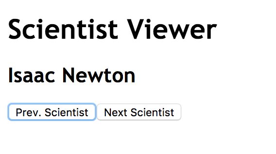
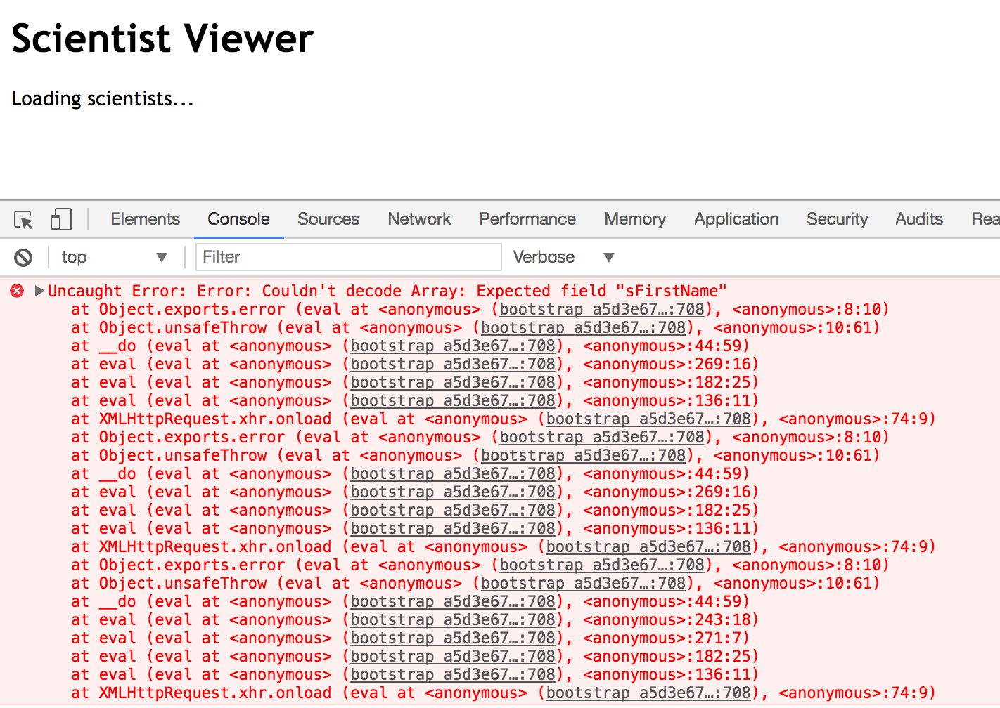
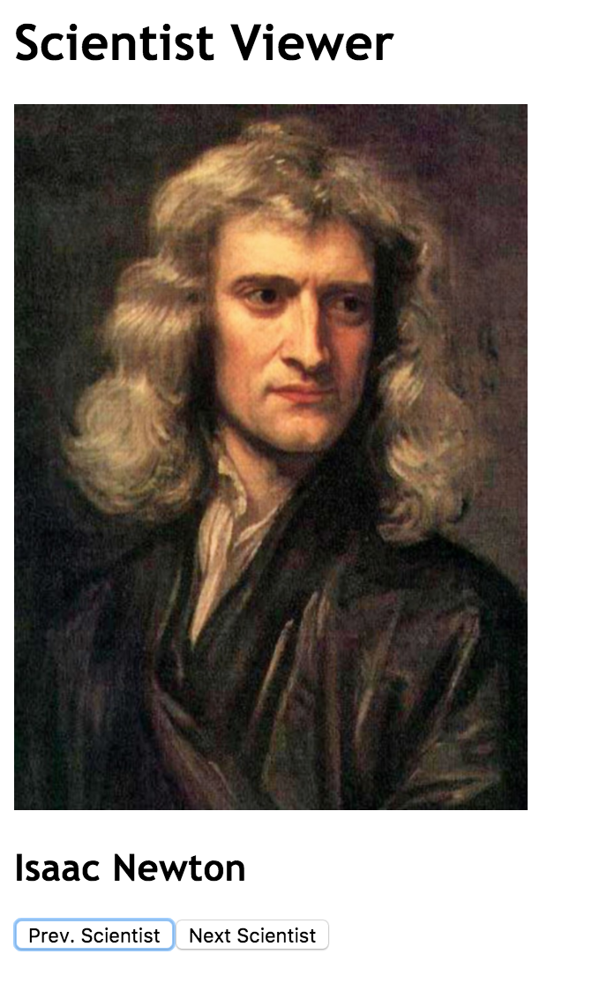

# Connecting a Haskell Backend to a PureScript Frontend
## Introduction
At [Stack Builders](https://www.stackbuilders.com) we are working on a full-stack app with [CollegeVine](https://www.collegevine.com/) using Functional Languages.
We have a [Haskell](https://www.haskell.org) backend written in [Servant](http://haskell-servant.readthedocs.io) that manipulates the database and offers some endpoints to a [PureScript](http://www.purescript.org) frontend,
that does all the React-like magic to show a really nice interface on the user's browser.
It's great because we have advanced types, purity and all the awesome benefits that the Functional World offers.
But not everything is perfect.

### Motivation
The problem is that we have two different codebases: one in Haskell and the other in PureScript.
The syntax is almost the same, but not exactly the same. For example, in Haskell we do:
```Haskell
{-# LANGUAGE DeriveGeneric #-}

data Blah = Blah
  {
    bFoos :: [Foo]
  } deriving (Generic)
```
Whereas if we want to get a Generic instance for my `Blah` type, in PureScript we have to do:

```Haskell
data Blah = Blah
  {
    bFoos :: Array Foo
  }

derive instance genericBlah :: Generic Blah
```
It's almost the same, but I bet you a penny that Haskell will not accept that `derive instance` declaration.
Also, in PureScript we import typeclasses using `import MyModule (class MyClass)`,
and we initialize records with `Constructor {field : value}`, whereas in Haskell it's `import MyModule (MyClass)` and `Constructor {field = vale}`.
Tiny, but huge differences.

At the end of the day, that means we can't directly share files.
So we have types that describe the entities in the backend,
and we have the same types that describe the same entities in the frontend, in different files.
And every now and then, the backend team changes something on the backend types,
but forgets to change it on the front end types.
Suddenly we start to get the dreaded runtime errors,
because the frontend is no longer able to decode the data sent from the backend,
because that data no longer conforms to the standard the frontend expects.

Ideally, we would separate the common types to some files, and use these files in the backend and the frontend.
Then, the frontend inevitably follows the changes in types from the backend,
and refuses to compile if the change is too big and a developer has to look at it.
But, again, Haskell code is almost like PureScript code, but not completely compatible.
So this is not possible.

### The next best thing
Well, if we can't use the same files, we have to look for something not that far from that ideal world.
If we can somehow automatically generate PureScript data types from Haskell data types,
we could prevent the problem of type difference. We would effectively extend the typesystem from the backend to the frontend.

### purescript-bridge to the rescue
Turns out this idea is not new, and Robert Klotzner has already done it for us, which is quite nice.
From the docs, [`purescript-bridge`](https://hackage.haskell.org/package/purescript-bridge) tells us it will write PureScript types from Haskell types,
as long as those types conform to some restrictions.
But let's not talk about limitations. Instead, let's talk about awesomeness. But, before that, let's review the general architecture.

## Simple WebApp
Our app will be split into two parts:
 * A Haskell backend that talks to the database, coordinates people, sends emails and all that awesome stuff backends do.
 * A PureScript frontend that compiles to JavaScript and runs on the browser;
   showing, in marvellous details using React, all the data that it fetches from the backend.

The two parts have to talk to each other in order to have something useful.
We will use REST and JSON. That's it - the frontend will send HTTP requests full of JSON messages to the backend, in order to trigger actions, and the backend will respond to those requests with more JSON full of data, to be shown to the user.

### WebApp idea
So we are going to build the next big thing. The website everyone definitely needs in their lives: a scientist browser,
where we can browse names, photos and biographies of renowed scientists.

Well, it may not be the next big thing, but you will definitely need it. I promise.

### Backend
The backend is going to be simple: trusty Servant is going to provide us with endpoints that talk JSON and are full of scientist biographies. The API will provide (for now) a single endpoint:
* `GET /scientist/` : return a list of scientist biographies

```haskell
data Scientist = Scientist
  { sId        :: Int
  , sFirstName :: String
  , sLastName  :: String
  } deriving (Eq, Show)
```

### Frontend
The frontend is (somewhat) simple. It's going to be the [Pux starter app](https://github.com/alexmingoia/pux-starter-app) with small modifications to pull data from our backend. After pulling the data, it's going to show the scientists one at a time, offering buttons to see the next or the previous one.



_The Best Thing Since Sliced Bread: the Scientist Viewer!_

### Changing the app
Did you notice that we have already run into limitations?
Some scientists don't just have a name and surname.
My friend [Gottfried Wilhelm Leibniz](https://en.wikipedia.org/wiki/Gottfried_Wilhelm_Leibniz) - the man behind Calculus - has a middle name. But that is not the only case.
[Wernher von Braun](https://en.wikipedia.org/wiki/Wernher_von_Braun) was a rocket scientist, and he has `von` in the middle of his name. That's not technically a middle name, but we somehow have to accept it.
And [Pythagoras](https://en.wikipedia.org/wiki/Pythagoras), one of the pioneers of Geometry - well, we have no idea of his surname, if he ever had one.

So it's time to change the name format.

```haskell
 data Scientist = Scientist
  { sId        :: Int
  , sNames     :: [String]
  } deriving (Eq, Show)

$(deriveJSON defaultOptions ''Scientist)
```



_Runtime errors? I hate runtime errors!_

Ooops. We need to tweak the frontend to make it accept the new format.

```haskell
data Scientist = Scientist {
                 id :: Int
               , names :: Array String
               }

instance decodeScientist :: DecodeJson Scientist where
  decodeJson j = case toObject j of
                  Just o -> do
                    id <- o .? "sId"
                    names <- o .? "sNames"
                    pure $ Scientist {
                        id: id,
                        names: names
                      }
                  Nothing -> Left "Noparse"
```


_Yay, rolling again!_

Ok, we can do that, but it's kinda silly, isn't it?
I'm copying the same code from the backend to the frontend, from data structures to serializer algorithms.
I can watch myself getting very annoyed because of this repetition.
But, do you imagine what would happen if we happened to have a backend team and a frontend team? Unless the communication is perfect, we are just going to have trouble.
And we know it's impossible to have perfect communication, specially as the team grows.


## Tutorial
### Connecting the types on the backend to the frontend
First of all, let's extend the types from the backend to the frontend. This is no small feat, but it's definitely worth it. We'll do it in several steps.

First we extract the types to be shared to other files for the sake of keeping it all organised:

```haskell
{-# LANGUAGE TemplateHaskell #-}
module Types where

import Data.Aeson
import Data.Aeson.TH

data Scientist = Scientist
  { sId        :: Int
  , sNames     :: [String]
  } deriving (Eq, Show)

$(deriveJSON defaultOptions ''Scientist)

scientists :: [Scientist]
scientists = [ Scientist 1 ["Isaac", "Newton"]
             , Scientist 2 ["Albert", "Einstein"]
             , Scientist 3 ["Gottfried", "Wilhelm", "Leibniz"]
             , Scientist 4 ["Stephen", "Hawking"]
             , Scientist 5 ["Pythagoras"]
             , Scientist 6 ["Wernher", "von", "Braun"]
             ]
```

Now we need support for Generics.

```haskell
{-# LANGUAGE TemplateHaskell #-}
{-# LANGUAGE DeriveGeneric #-}
module Types where

import Data.Aeson
import Data.Aeson.TH
import GHC.Generics (Generic)

data Scientist = Scientist
  { sId        :: Int
  , sNames     :: [String]
  } deriving (Eq, Show, Generic)

[...]
```

And finally we create a Bridge binary and summon `purescript-bridge`.

```Haskell
module Main where

import Types (Scientist)
import Language.PureScript.Bridge (writePSTypes, buildBridge, defaultBridge, mkSumType)
import Data.Proxy (Proxy(..))

main :: IO ()
main = writePSTypes "../frontend/src" (buildBridge defaultBridge) myTypes
  where
    myTypes = [ mkSumType (Proxy :: Proxy Scientist)
              ]
```

Now, when we execute the bridge, we get some sweet auto-generated PureScript code.

```shell
backend$ stack exec bridge
The following purescript packages are needed by the generated code:

  - purescript-prim

Successfully created your PureScript modules!
```

The generated code is quite boring, yet exactly what we wanted.

```haskell
-- File auto generated by purescript-bridge! --
module Types where

import Prim (Array, Int, String)

import Data.Generic (class Generic)


data Scientist =
    Scientist {
      sId :: Int
    , sNames :: Array String
    }

derive instance genericScientist :: Generic Scientist
```

Ok, it's time to make the frontend use the auto-generated code. It's easy. We are already auto-generating the `Scientist` datatype, so we are just going to import it.

```haskell
import Types (Scientist)
```

Now our app has a lot less repetition.

### Using generics to simplify communication
But that's not enough. Although the types are the same, the JSON instances are not the same. And they should be.
But having to copy instances from the backend to the frontend is kind of silly.
All I want is to copy this backend data to the frontend, where both use an equivalent representation!
There has to be a way to do that automatically.

Well, there is a way to do that. Can you see the `Generic` instances we have introduced somehow?
We are going to take advantage of these instances. In fact, I have not invented this - the [Argonaut](https://github.com/purescript-contrib/purescript-argonaut) guys did it!
They made some [Generic Argonaut-Aeson codecs](https://pursuit.purescript.org/packages/purescript-argonaut-generic-codecs/6.0.3/docs/Data.Argonaut.Generic.Aeson) which should make the frontend speak [Aeson](https://hackage.haskell.org/package/aeson) exactly the same way the backend does.

The backend is already using generic encoding thanks to Template Haskell. The code that does the magic is:
```Haskell
$(deriveJSON defaultOptions ''Scientist)
```

But we have to tweak the frontend to do it.
```Haskell
import Data.Argonaut.Generic.Aeson as Aeson
...
    let result = do
                  scientists <- Aeson.decodeJson request.response
                  pure $ ScientistsLoaded $ Scientist.State {
                                                scientists: scientists
                                                , current: 0
                                              }
...
```
And we can drop `decodeScientist`. Now we are rolling!

### Changing the app again
You know what? We don't need that much of an ID, but a photo would definitely help here. Let's change the types again.

```Haskell
data Scientist = Scientist
  {
    sNames     :: [String]
  , sPhotoUrl  :: String
  } deriving (Eq, Show, Generic)

...

scientists :: [Scientist]
scientists = [ Scientist ["Isaac", "Newton"] "https://upload.wikimedia.org/wikipedia/commons/3/39/GodfreyKneller-IsaacNewton-1689.jpg"
             , Scientist ["Albert", "Einstein"] "https://upload.wikimedia.org/wikipedia/commons/d/d3/Albert_Einstein_Head.jpg"
             ...
             ]
```

Now we run the bridge.

```bash
backend$ stack exec bridge
The following purescript packages are needed by the generated code:
                                                                   
  - purescript-prim                                                
                                                                   
Successfully created your PureScript modules!                      
backend$
```
And now we have the new types on the frontend:

```Haskell
data Scientist =
    Scientist {
      sNames :: Array String
    , sPhotoUrl :: String
    }

derive instance genericScientist :: Generic Scientist
```

It seems Lady Luck was on our side.
The frontend hasn't failed to compile, but that's because we have removed an ID field we weren't using anywhere.
If we happened to remove a field we were using, the compiler would definitely refuse to compile.

Now that we have photos on the data type, let's show 'em.

```Haskell
view (State s) =
  ...
    Just (Scientist scientist) ->
      div []
        [
          div [] [
            img [ src scientist.sPhotoUrl, height "400px" ] [],
            h2 [] $ (\x -> text (x <> " ")) <$> scientist.sNames
          ]
        , button [ onClick (const Previous) ] [ text "Prev. Scientist" ]
        , button [ onClick (const Next) ] [ text "Next Scientist" ]
        ]
```



_Now I see you, Mr. Newton_

### Analysing the result
Thanks to `purescript-bridge`, we have removed the mental tax on the shared types on the frontend.
The backend will generate those types for us, so we no longer have to care about them.

Also, the backend folks can make changes without thinking too much about compatiblity with the frontend,
because the tools we built will tell us when something is broken.

Even better, the communication has been simplified a lot.
We don't have to care anymore about message format, decoders and encoders, because Aeson and Argonaut, along with `purescript-bridge`, handles that for us.

And finally, the most awesome of all is that the type system is automatically consistent on the frontend and the backend.
We have successfully connected the two worlds; and, as a result, we have gained some extra safety and peace of mind.

## Conclusion
I shall thank Robert Klotzner for the awesome package he made.
`purescript-bridge` is incredible in the sense that it helps us extend the wonders of a strong type system across boundaries,
 such as different subsystems and languages. Definitely `purescript-bridge` it is worth every bit it costs.

### More information
* `purescript-bridge` on Hackage: https://hackage.haskell.org/package/purescript-bridge
* The code in this tutorial: https://github.com/stackbuilders/tutorials/tree/tutorials/tutorials/functional-full-stack/purescript-bridge/code
* `purescript-bridge` Github's repository: https://github.com/eskimor/purescript-bridge

### Thanks to
* [Mohan Zhang](http://www.mohanzhang.com/) from [CollegeVine](https://www.collegevine.com), for letting us experiment, play and deploy `purescript-bridge` in order to improve the type safety. BTW, if you want to study in a prestigious university in the USA, the team at [CollegeVine](https://www.collegevine.com) knows all the secrets to get you accepted.
* [Wikipedia](https://www.wikipedia.org/) for providing nice photos of famous scientists, and for the great work they are doing.
