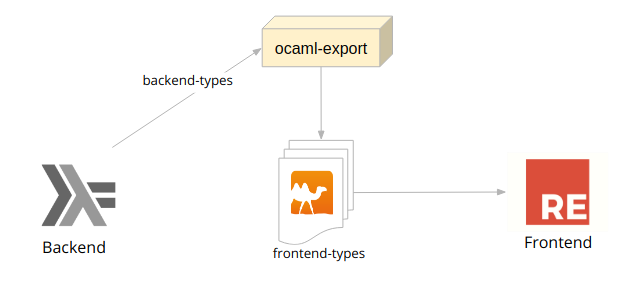

# Bridge Haskell and Reason

The different tools and technologies that we often use when developing software add complexity to our systems. One of the challenges that we face in web development is that we are often writing the backend and the frontend in different languages and type systems. To continue to build reliable applications we need a way to connect both.

We need to make sure our applications are reliable and do not break when the API changes. We can build a bridge that help us have a safe crossing between the backend and the frontend. We can do that with a code generation tool that allows us to use the same types on both sides of the application.

You will see a real-life case, using Haskell as a backend language, how you can get Reason (OCaml) types and JSON serialization/deserialization almost for free using Generics and how you can make sure your serialization is correct with automatic golden tests generation.

## Why did we choose Reason?

[Reason](https://reasonml.github.io/) is a new syntax and toolchain for [OCaml](https://ocaml.org/) created by Facebook. OCaml is a decades old language that has been relegated mostly to academia but has inspired a lot of new languages (Rust, F#). Sadly, it does not have the kind of community we need for web development where things move at high speed.

Facebook built Reason to solve real-life problems in production apps - Facebook Messenger is over [50% migrated to Reason](https://reasonml.github.io/blog/2017/09/08/messenger-50-reason.html), and they reduced bugs and compilation times by doing so.

When we talk about toolchain, we're talking about [Bucklescript](https://bucklescript.github.io/en/). Bucklescript is a compiler that will take Ocaml (or Reason code -- they are interchangeable) and make it into readable and performant JavaScript code.

So... why did we choose Reason? Well, because of several reasons (no pun intended)

- **Reason is an awesome way ([if not the best way](https://www.freecodecamp.org/news/psst-heres-why-reasonreact-is-the-best-way-to-write-react-5088d434d035/)) to write React Apps**: React was originally developed in StandardML (a cousin of OCaml).
- **It has a [great type system](https://blog.logrocket.com/what-makes-reasonml-so-great-c2c2fc215ccb/)** Which makes developing and refactoring a breeze.
- **It's [functional](https://www.freecodecamp.org/news/reasonml-the-functional-parts-675d17caa63f/)**: FP makes our code cleaner, more composable and easy to maintain.
- **JS [interop](https://reasonml.github.io/docs/en/interop)**: unlike [Elm](https://guide.elm-lang.org/interop/ports.html) - a pure and functional language based in Haskell - JS interop is very easy in Reason. You can almost put native JS code by resigning a little bit of purity.
- Reason leverages both the OCaml community and JS community and that gives us an unique ecosystem to work with.

There are other alternatives to work with types like Typescript or Flow. While they are much better than using plain JS, they don’t provide the same guarantees. Typescript/Flow add types to Javascript too, but they do so by extending the language with all the problems and pitfalls JS already have. Reason, on the other hand, starts from the rock-solid foundation that is OCaml and then builds up its easy of use and community development that JS provide.

## How did we implement it?

The types of our backend application were defined in Haskell and we wanted to use the _same types_ in our front end application. Since Haskell and OCaml types are similar in a semantic way, we decided to use a tool to transform them. [`ocaml-export`](http://hackage.haskell.org/package/ocaml-export) is a tool that takes Haskell types and - using [Generics](http://hackage.haskell.org/package/base-4.12.0.0/docs/GHC-Generics.html) - can analyze the type and make it an OCaml type so we can use it in our Reason front end.



For instance, if we have this type in Haskell.

```hs
data User = User
  { name :: String
  , age  :: Int
  }
```

`ocaml-export` transforms it into this:

```ocaml
type user =
  { name : string
  ; age : int
  }
```

It also works with sum types:

```hs
data Status
  = Inactive String
  | Active
```

gets transformed into:

```ocaml
type status =
  | Inactive of string
  | Active
```

### JSON Encoding

This tool also generates JSON serialization and deserialization functions in OCaml. It does this by assuming we're using the [`bs-aeson`](https://github.com/plow-technologies/bs-aeson) library. Our previous examples would look like this:

```ocaml
let encodeUser x =
  Aeson.Ecode.Object_
    [ ("name", Aeson.Encode.string x.name)
    ; ("age", Aeson.Encode.int x.age)
    ]
```

this function will take a user object and serialize it into a JSON string of the form:

```json
{
  "name": "John Doe",
  "age": 27
}
```

With the sum type the encoding function is a little trickier but works in the same fashion. We make the JSON with the type constructor description in the `tag` field and the contents (if any) in the `contents` filed. These are the [Aeson](http://hackage.haskell.org/package/aeson-1.4.5.0/docs/Data-Aeson.html) Haskell library [defaults](http://hackage.haskell.org/package/aeson-1.4.5.0/docs/src/Data.Aeson.Types.Internal.html#defaultTaggedObject). The `encodeStatus` function will be generated as follows:

```ocaml
let encodeStatus x =
  match x with
  | Inactive y0 ->
      Aeson.Encode.object_
        [ ("tag", Aeson.Encode.string "Inactive")
        ; ("contents", Aeson.Encode.string y0)
        ]
  | Active ->
       Aeson.Encode.object_
        [ ("tag", Aeson.Encode.string "Active")
        ]
```

This will produce a JSON of the form:

```json
{
  "tag": "Inactive",
  "contents": "description"
}
```

or

```json
{
  "tag": "Active"
}
```

Notice how all these functions are type safe. The variable `y0` can not be anything other than a `string`, yet - thanks to OCaml powerful type inference engine - our code does not look polluted with type annotations. The engine _knows_ that `x` is of type `status` because it has to match with its constructors and it _knows_ y0 is a `string` because it has to match with the `Inactive` constructor. Also, OCaml forces us to deal with all the possible matches of the `status`; if we somehow forget to deal with the `Active` constructor, our code won't compile.

### JSON decoding

The same way we get JSON encoding for free with `ocaml-export`, we also get decoding. That is when we get a JSON response from the backend, we have a function that allows us to transform that JSON into an OCaml object **in a type-safe way**.

This is how the `decodeUser` function looks like:

```ocaml
let decodeUser json =
  match Aeson.Decode.
    { name = field "name" string json
    ; age = field "age" int json
    }
  with
  | v -> Belt.Result.Ok v
  | exception Aeson.Decode.DecodeError message -> Belt.Result.Error ("decodeUser: " ^ message
```

Notice how this function doesn't fail. It will always return a [`Result`](https://bucklescript.github.io/bucklescript/api/Belt.Result.html). In this case it will return either an `Ok` wrapping the decoded value or an `Error` wrapping
the error message. This is similar to how `Either` works in Haskell, and forces us to handle the error state in a type-safe way.

The sum type decoding works in a similar fashion:

```ocaml
let decodeStatus json =
  match AesonDecode.(field "tag" string json) with
  | "Inactive" -> (
    match Aeson.Decode.(field "contents" string json) with
    | v -> Belt.Result.Ok (Inactive v)
    | exception Aeson.Decode.DecodeError message -> Belt.Result.Error ("Inactive: " ^ message)
    )
  | "Active" -> Belt.Result.Ok Active
  | tag -> Belt.Result.Error ("Unknown tag value found '" ^ tag ^ "'")
  | exception Aeson.Decode.DecodeError message -> Belt.Result.Error message
```

Again, all the OCaml code that is presented here is autogenerated by `ocaml-export` and it is production-ready code that can be used in your Reason app. :tada:

### Testing

Although the type system helps us to make sure our program is correct, it can't replace tests. We need to make sure that tghe serialization/deserialization that happens in our front end is the same as the one in our backend. And tests are the only way to achieve that.

Luckily, `ocaml-export` also generates JSON [golden files](https://medium.com/@jarifibrahim/golden-files-why-you-should-use-them-47087ec994bf) for all the types we feed into it. These golden files are generated using `Aeson` and [`Arbitrary`](http://hackage.haskell.org/package/QuickCheck-2.13.2/docs/Test-QuickCheck-Arbitrary.html) from the haskell backend. These JSONs are examples of how our backend serializes JSON requests.

Now we have to make tests to prove that our OCaml code can rad those files and then serialize the resulting object into the exact same JSON we started with. Of course, `ocaml-export` generates the test suite too ;). Here is how it looks:

```ocaml
let () =
  AesonSpec.goldenDirSpec
    OnpingTypes.decodeUser
    OnpingTypes.encodeUser
    "user test suite"
    "golden/User";

```

We use [`bs-aeson-spec`](https://github.com/plow-technologies/bs-aeson-spec) to automatize our tests. The `goldenDirSpec` function takes a serialization and a deserialization function and run them against the golden files, assuring that the serialization in our front end works in the same way as in our backend.

## How does it look like?

You can take a look at a complete example [here](https://github.com/stackbuilders/compose-2019). You’ll find a complete Haskell backend and a complete ReasonML frontend, along with the bridge between them. When you compile the frontend, all the types from the backend will cross that bridge into the frontend and they will be tested and used by the frontend. Take a look and comment about what you think!

## What's next?

There are a couple of issues still in development. The project is open sourced, so you can contribute if you like ;)

**Support for recursive types**

At the moment, you cannot generate types that reference themselves (think linked lists or tree-like structures). It is possible to build such types in OCaml, but we need a way to detect a cyclic structure in Generic Haskell to translate that to the migrated type

**Resolve type dependency order**

The way OCaml works, a type has to be declared before you can use it. That is not the case for Haskell where the declaration order of dependencies does not matter. We would have to create a dependency graph of our types and then migrate those types in order so there aren’t any dependency problem (also avoid cyclic dependency)

**Automatically create `bs-fetch` calls using servant route types**

Besides generating the types, the golden files and the tests, it would be a nice feature to generate fetch functions (using bs-fetch) for the servant route types. That way you could create a complete frontend infrastructure automatically :tada:
